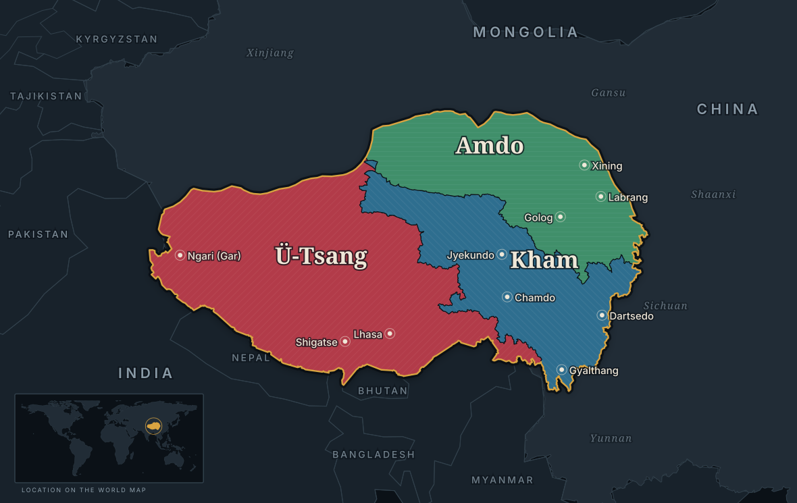

# Great Tibet Map

**An interactive map of Ü-Tsang, Kham and Amdo — the three regions of Tibet.** ཆོལ་ཁ་གསུམ་ · *chöl-kha-sum*, "the three regions of Great Tibet": the way Tibetans have long
described their own country. Click a region and the panel tells you its Tibetan
name, its dialect, its landscape, its principal towns, its area as drawn, and
the present-day units it now falls under.

[](LICENSE)
[](LICENSE)
[](#requirements)
[](#try-it)

**Live demo → <https://zorawae.github.io/Great-Tibet-Map/>**

The whole thing is one self-contained HTML file. No framework, no build step,
no `npm install`, no tracking, nothing to configure before it works. Drop it on
a server, or paste a single block into a page you already have.



---

## Contents

- [Try it](#try-it)
- [Use it on your site](#use-it-on-your-site)
- [Features](#features)
- [Configuration](#configuration)
- [JavaScript API](#javascript-api)
- [Requirements](#requirements)
- [About the boundaries](#about-the-boundaries)
- [Contributing](#contributing)
- [License](#license)

## Try it

Open <https://zorawae.github.io/Great-Tibet-Map/> — that is the map, hosted.

To run it yourself, clone the repository and open `tibet-three-regions-map.html`
in any browser. Nothing to install, no server to start.

```sh
git clone https://github.com/Zorawae/Great-Tibet-Map.git
cd Great-Tibet-Map
open tibet-three-regions-map.html      # macOS; xdg-open on Linux, start on Windows
```

To publish your own copy, enable **GitHub Pages** on your fork (Settings → Pages
→ deploy from the default branch). Everything here is static; there is nothing
to build.

## Use it on your site

| File | What it is |
|---|---|
| `tibet-three-regions-map.html` | The interactive widget. Open directly or embed. |
| `tibet-three-regions-dark.svg` | Static map, dark. For ``, a CMS, or print. |
| `tibet-three-regions-light.svg` | Static map, light. |
| `index.html` | The project's landing page, served by GitHub Pages. |
| `INTEGRATION.md` | Full integration, theming and API reference. |
| `LICENSE` | MIT for the code, CC0 1.0 for the map and text. |
| `og-image.png`, `sitemap.xml` | Social-share card and sitemap for the hosted site. |

**Option 1 — iframe.** Fully isolated from your CSS; you only have to pick a
height. [`INTEGRATION.md`](INTEGRATION.md) has a `postMessage` snippet that
makes it self-sizing.

```html
<iframe src="/maps/tibet-three-regions-map.html"
        style="width:100%;height:1050px;border:0"
        loading="lazy"
        title="The three regions of Tibet"></iframe>
```

**Option 2 — inline.** Copy everything between the `COPY FROM HERE` and
`COPY TO HERE` comments in the HTML file and paste it into your page. That
block is the container div, its `<style>` and its `<script>` — nothing else is
needed. Every selector is scoped to `.tibmap` and every SVG class is prefixed
`tm-`, so it will not collide with your stylesheet.

**Option 3 — static image.** Use the two SVGs in a `<picture>` element so the
map follows the visitor's colour scheme:

```html
<picture>
  <source srcset="/maps/tibet-three-regions-dark.svg"
          media="(prefers-color-scheme: dark)">
  
</picture>
```

The static SVGs carry Latin labels only. An SVG loaded through `` cannot
fetch a webfont, and most systems ship no Tibetan font, so the script would
render as empty boxes. The interactive version shows both.

## Features

- **Three selectable regions**, each with its own colour *and* its own hatch
  angle, so they read apart without depending on colour.
- **Bilingual labels** — English, Tibetan, or both.
- **Current borders overlay** — put today's TAR and provincial boundaries over
  the cultural regions to compare the two.
- **Rivers and ranges** — the great rivers that rise on the plateau and five of
  its lakes; the six gang of Kham, from *Chushi Gangdruk*, with the Himalaya,
  Kunlun, Gangdise and Nyenchen Tanglha; and four peaks. Named in Tibetan, and
  in Latin letters, following the same Labels toggle as the towns. Drawn only
  where they run through the three regions. Off by default; the regions come
  first and the physical layer is context you opt into. One *Physical* button
  cycles Off → Rivers → Ranges → Both.
- **Towns, world locator inset and dark/light themes**, each toggleable.
- **Zoom and pan** — a `+` / slider / `−` control at the map's corner, drag to
  pan, pinch on a touch screen, double-click, `Ctrl`/`⌘` and the wheel, or the
  keyboard. A plain wheel is left alone so the map never swallows the scroll of
  the page it sits in, and one finger only pans once you have zoomed in.
- **A proportional bar** across the top, sized by each region's share of the
  total area.
- **Keyboard accessible** — regions are focusable (`Tab`, then `Enter` or
  `Space`), the panel is `aria-live="polite"`, every shape carries a label, and
  `prefers-reduced-motion` is respected.
- **Responsive** down to phone widths through container queries.
- **A small JS API**, so the map can drive the rest of your page.

## Configuration

Set these on the container div. They can also be changed at runtime.

```html
<div class="tibmap" id="tibet-map"
     data-theme="auto"        <!-- dark | light | auto -->
     data-labels="both"       <!-- both | en | bo -->
     data-admin="false"       <!-- true shows current provincial borders -->
     data-cities="true"       <!-- true | false -->
     data-inset="true"        <!-- world locator box -->
     data-rivers="false"      <!-- true draws the rivers and lakes -->
     data-ranges="false"      <!-- true draws the ranges and peaks -->
                              <!-- the two stay independent; the Physical
                                   button cycles through their four combos -->
     data-zoom="true"        <!-- false removes zoom, pan and the control -->
     data-selected="kham">    <!-- utsang | kham | amdo | "" -->
</div>
```

Colours, fonts, maximum width and corner radius are CSS custom properties —
`--tm-utsang`, `--tm-kham`, `--tm-amdo`, `--tm-gold`, `--tm-display`,
`--tm-ui`, `--tm-max`, `--tm-radius` and more. Override them anywhere after the
widget's `<style>`; [`INTEGRATION.md`](INTEGRATION.md) lists all of them.

## JavaScript API

```js
TibetMap.select('kham');        // or 'utsang', 'amdo', '' to clear
TibetMap.get();                 // 'kham' | null
TibetMap.setTheme('light');
TibetMap.setZoom(2.5);          // 1 (fit) to 8
TibetMap.getZoom();             // 2.5
TibetMap.resetView();           // back to fit, centred
TibetMap.on(function (region) { /* fires on every selection change */ });
TibetMap.regions;               // the descriptive copy, editable
TibetMap.data;                  // raw paths, areas, coordinates
```

Useful when you want the map to drive other content — swapping a photograph,
filtering a list of monasteries, scrolling to a section.

## Requirements

Any current browser. The widget uses CSS custom properties, container queries
and `ResizeObserver`, so Chrome/Edge 105+, Firefox 110+ and Safari 16+ are the
practical floor. No polyfills, no bundler, no runtime dependencies.

The one network request is an optional `@import` of three Google Fonts
families. **Noto Serif Tibetan is load-bearing:** most systems have no Tibetan
font, and without it every ཆོལ་ཁ་གསུམ string renders as empty boxes — self-host
it if you cannot call Google. **Fraunces** (display) and **IBM Plex Sans** (UI)
are cosmetic; delete the `@import` and they fall back to Georgia and your
system UI font. Remove the import entirely and the widget is fully offline.

## About the boundaries

The regions are built by grouping present-day prefectures, then dissolving and
projecting them in an Albers equal-area conic (standard parallels 26°N / 41°N,
central meridian 92°E). The area figures are therefore measurements of the
shapes actually shown, not numbers quoted from elsewhere:

| Region | Area as drawn | Share |
|---|---:|---:|
| Ü-Tsang | 1,074,855 km² | 49.0% |
| Kham | 540,293 km² | 24.7% |
| Amdo | 576,079 km² | 26.3% |
| **Combined** | **2,191,227 km²** | |

Each region is the union of these present-day units:

- **Ü-Tsang** — Lhasa, Shigatse, Nyingtri, Lhoka, Nagchu, Ngari, plus the
  Gdang La(གདང་ལ་)/Changthang exclave administered from Na-gor-mo(ན་གོར་མོ་).
- **Kham** — Chamdo, Garzê, Yushu, Dêqên, Muli(རྨི་ལི་), and the Gyalrong counties
  of Ngawa (Barkham, Chuchen, Tsanlha, Li, Trochu(ཁྲོ་ཆུ་), Mowun, Lunggu(ལུང་དགུ་)).
- **Amdo** — the Tso Ngön(མཚོ་སྔོན་) prefectures: Ziling(ཟི་ལིང་།), Tsoshar(མཚོ་ཤར་),
  Tsojang(མཚོ་བྱང་), Malho(རྨ་ལྷོ་), Tsolho(མཚོ་ལྷོ་), Golog(མགོ་ལོག), Tsonub(མཚོ་ནུབ་); plus
  Kanlho(ཀན་ལྷོ་) in Gansu, and northern Ngawa (Ngawa, Dzoge, Marthang, Dzamthang,
  Zungchu, Zitsa Degu).

**Editor's note on the names.** Places are named in the form the map itself
uses, with the Tibetan in brackets wherever an established Tibetan name
exists. Three conventions keep the lists from drifting:

- The bracket after Ngawa lists that prefecture's **Gyalrong counties** and
  nothing else. A place inside a prefecture already named on the same line is
  covered by it and is not repeated — Lithang sits in Garzê, Gyalthang
  (Shangri-La) in Dêqên — and a town or a walled quarter is not an entry
  alongside a county.
- The units are **prefecture-level** unless a line says otherwise. Tso Ngön is
  the province, so it heads the prefectures that belong to it rather than
  standing beside them, and Kanlho, which is in Gansu, falls outside that group.
- **Yushu appears under Kham, not Amdo.** It is one of Qinghai's eight
  prefectures, which is why the Tso Ngön list has seven.

Romanisation is not standardised: the same name may be spelled one way in the
prose here and another in the widget's own data. The Tibetan is what binds them,
so where the two disagree the Tibetan is the name that counts.

**Checked against the CTA's own map.** The Central Tibetan Administration
publishes [a map of Tibet under the PRC](https://tibet.net/about-tibet/map-of-tibet/)
whose silhouette is the TAR, plus Qinghai, plus the Tibetan prefectures of
Gansu, Sichuan and Yunnan — so its northern and western edge is the TAR and
Qinghai provincial boundary. Measured against that boundary in Natural Earth
10m, the line here agrees to within 0.25° of latitude from 79°E round to 98°E,
which is finer than the ink on the printed map. Where it did not, at the top of
the Tsaidam, it now does. See [INTEGRATION.md](INTEGRATION.md) for the detail.

**Which of the several outlines this is.** Maps captioned "Tibet" do not all
draw the same shape. Four are in common circulation: the maximal historical
extent; the territory administered from Lhasa between 1914 and 1950; the Tibet
Autonomous Region alone from 1965; and the whole of the Tibetan territory as it
was distributed among Chinese provinces after the TAR was established. This map
draws the last of those — the same silhouette the CTA's map draws — and puts the
three cultural regions inside it. It is not the 1914–1950 administrative
boundary, and it is not the TAR on its own.

**These are traditional cultural regions of Great Tibet** Their
historical limits were never surveyed, they shifted over time, and different
sources draw them differently — especially along the Gyalrong, Kongpo and
Kokonor margins. Treat the lines as indicative; the *Current borders* toggle
overlays today's boundaries so a reader can compare.

**Map scope and context.** This map is intended to show how the historical
Tibetan territorial divisions correspond to, or overlap with, present-day Chinese
administrative divisions. It illustrates the traditional territorial divisions of
Tibet, overlaid onto the current provincial and administrative boundaries of the
People's Republic of China.

For clarity, this map includes only territories that are currently administered
by China. It does not depict or claim any Tibetan territories that historically
formed part of the broader Tibetan cultural or political sphere but are located
outside the present-day boundaries of Chinese governance.

**Checked against a reference.** The silhouette was compared with a published
Tibetan cultural-area map by extracting that map's outline and fitting the two
together; they agree over 92.9% of their combined area. The remainder is a
fringe of a few tens of kilometres, plus Arunachal Pradesh, which lies outside
this map by design. That figure predates the Tsaidam correction above, which
added about 7,000 km².

[`INTEGRATION.md`](INTEGRATION.md) documents the prefecture grouping for each
region and the northern-rim closure in full.

## Contributing

Issues and pull requests are welcome. There is no build step and no test suite:
edit the HTML file, open it in a browser, and check the widget still works in
both themes, in all three label modes, and with a keyboard.

Most useful contributions:

- **Boundary corrections.** Please cite a source — a published cultural-area
  map, a scholarly work, a prefecture list. "The line looks wrong near X" is a
  fine issue to open even without one.
- **Translations and Tibetan text.** Corrections to spelling, transliteration
  or wording in the region descriptions are very welcome.
- **Accessibility and browser bugs.** Say which browser, which version, and
  what you saw.
- **Integrations.** Wrappers for a CMS or framework, or a self-hosted-font
  build.

Two things to keep in mind. This map touches a contested subject, so keep issue
threads to the cartography, the sources and the code — political argument in
the tracker will be closed. And please keep the widget dependency-free and in
one file: that constraint is the point of the project.

## License

Two sets of terms, because this is part software and part cartographic work:

- **Code** — the widget's HTML, CSS and JavaScript — under the
  [MIT License](LICENSE).
- **Map and text** — the boundary geometry, the two static SVGs, the region
  descriptions and the documentation prose — dedicated to the public domain
  under [CC0 1.0](https://creativecommons.org/publicdomain/zero/1.0/).

In short: use it anywhere, commercially included. The map and the writing carry
no attribution requirement at all. Credit is welcome but not owed:

> Great Tibet Map by Zorawae, CC0 1.0 —
> [https://github.com/Zorawae/Great-Tibet-Map](https://zorawae.github.io/Great-Tibet-Map/)

The Google Fonts families are not part of this repository and carry their own
SIL Open Font License.


------------------ FREE TIBET ------------------ 

